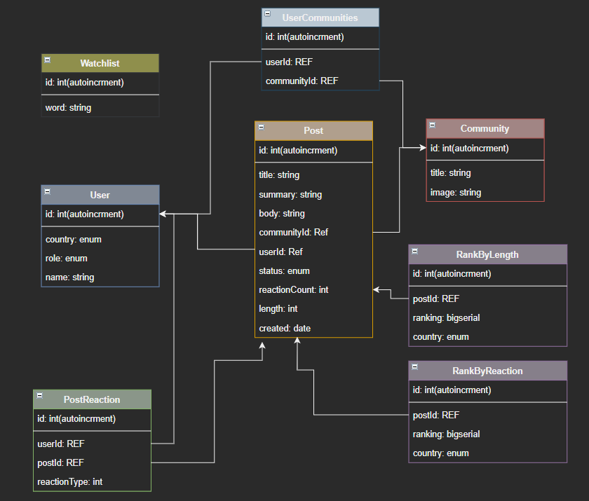

# Wisdo exercise
## First time run
```bash
npm run docker:startd
# Then, Seed the database with data
npm run docker:seed
# Then to see logs you can run
npm run docker:start
```
Then the server would be up on http://localhost:3000

## Alternative local debug
```bash
# Install NPM
# (FOR MAC)
curl -o- https://raw.githubusercontent.com/nvm-sh/nvm/v0.38.0/install.sh | bash
# OR (FOR WINDOWS) - navigate to https://github.com/coreybutler/nvm-windows/releases
nvm use
npm i -g nodemon
npm i
docker-compose up -d db
npm run start:dev
```

## Testing
Run `npm run test`
- [Run in Band](docs/testing/run-in-band.md)

## Structure
- [Group by coupling](docs/group-by-coupling.md)

## More info
`Dockerfile` - uses multi-stage build - has dev and production envs
`hooks` - allows any update to post / create to trigger an email if content is in watchlist_words

## DB Schema


## Workers
Assume `npm run update-feed` would run every 3 hours and would repopulate `RankByReaction` and `RankByLength` tables

## Comments
1. This is my first production like Typescript project. I may error on the side of types and where to put declarations -
I wanted to try typescript as recommended but this may not be the most well-structured typescript
2. Some race condition that might happen - if a user scrolls the system, and now we are on the 3 hours window - 
trying to fetch next would result inaccurate data.
3. For production - I'll probably use `redis` for caching instead of node-cache (CacheService)
4. Given more time - Part of the integration tests can be moved into a unit test by injecting them some kind of repository instead of the actual database
5. I've used post reactions with reaction type to support different reaction in the future (Love, Cry,...)
6. Given more time - I would unittest the routes for security measurements
7. Given more time - I would add `newman` e2e testing to validate all is working as expected

## Alternative Designs
1. An alternative to `sequelize` would be [prisma](https://www.prisma.io/) which is a raising star -
I don't have enough experience with it - given more time - I might consider it
2. A possible solution might include controllers to create another layer between the routes, and the services -
Since the responsibility of the routes are limited I thought this would be over engineering and unneeded at this stage
